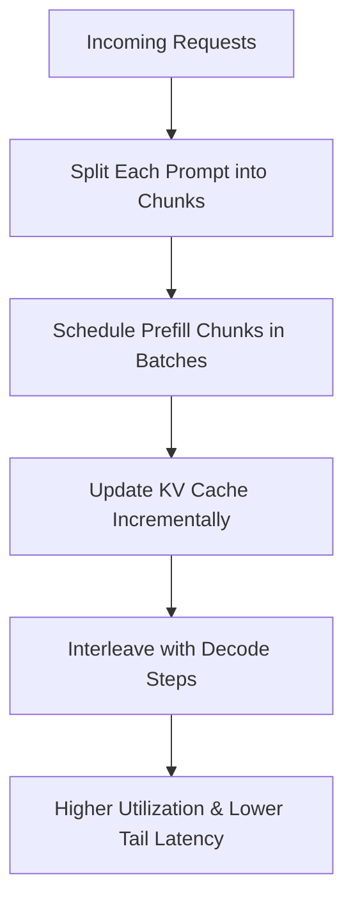
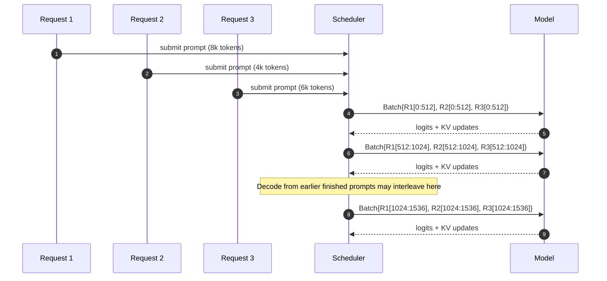

# Chunked Prefill — A Practical Guide

> **TL;DR**: *Chunked prefill* splits a long prompt’s prefill into small fixed-size token chunks so you can **batch across requests, pipeline with decode, smooth memory usage, and raise device utilization** without changing model outputs.

---

## Why chunked prefill?

Traditional inference has two phases:
1. **Prefill**: run the prompt end-to-end to build the KV cache.
2. **Decode**: generate token-by-token using the cache.

For long prompts and high concurrency, *monolithic* prefill causes:
- Poor batching (one big matmul monopolizes the device).
- Latency spikes and allocation burst for KV cache.
- Underutilized accelerators during other users’ requests.

**Chunked prefill** fixes this by micro-batching the prompt (e.g., 128–1024 tokens per chunk) and interleaving chunks from *different* requests.

---

## How it works (high level)



- **Split**: Slice input prompt into N chunks (`chunk_size` tokens each).
- **Batch**: Aggregate chunks from multiple requests into a single batch per step.
- **KV cache**: Update incrementally, avoiding huge one-shot allocations.
- **Interleave**: Scheduler shares device time with decode micro-steps.

---

## Cross-request batching (sequence)



---

## Timeline view (prefill && decode interleaving)

```mermaid
gantt
    dateFormat  X
    title Prefill/Decode Interleave (schematic)
    section Prefill (R1)
    chunk0 : 0, 10
    chunk1 : 12, 10
    chunk2 : 24, 10
    section Prefill (R2)
    chunk0 : 0, 10
    chunk1 : 12, 10
    chunk2 : 24, 10
    section Decode (R0)
    step t : 10, 2
    step t+1 : 22, 2
    step t+2 : 34, 2
```



- Prefill chunks execute in **waves** with brief decode steps in between.
- Actual timing is scheduler- and device-dependent; this is conceptual.

---

## Minimal pseudo-code (PyTorch-ish)

```python
def chunked_prefill(model, tokens, cache, chunk_size=512):
    # tokens: [L], cache: KV store (initially empty or partially filled)
    L = tokens.size(0)
    i = 0
    while i < L:
        j = min(i + chunk_size, L)
        chunk = tokens[i:j]                # [j-i]
        logits, cache = model(chunk, past_key_values=cache)
        # optionally: compute embeddings/logits for downstream (e.g., loss or routing)
        i = j
    return cache

# scheduler step (very simplified)
def schedule_step(pending_prompts, ready_for_decode, chunk_size=512, max_batch_tokens=8192):
    # 1) select a set of requests and slice their next chunks
    batch_chunks = []
    tokens_acc = 0
    for req in pending_prompts:
        if req.done_prefill: continue
        n = min(chunk_size, req.remaining_tokens())
        if tokens_acc + n > max_batch_tokens: break
        batch_chunks.append(req.take_next_chunk(n))
        tokens_acc += n

    # 2) run one batched prefill step
    if batch_chunks:
        batched_input = pad_and_pack(batch_chunks)  # attention masks, positions, etc.
        logits, kv_updates = model(batched_input, past_kv=batch_kv(batch_chunks))
        apply_kv_updates(batch_chunks, kv_updates)

    # 3) interleave decode (one or few steps), if any request is ready
    for req in ready_for_decode:
        token, cache = model.decode_step(req.last_token, past_kv=req.kv)
        req.append(token, cache)
```

Key points:
- **KV cache is updated per chunk**.
- You can **batch** chunks across requests to fill the device.
- **Interleave** decode steps between prefill waves for low latency.

---

## Tuning guidelines

- **`chunk_size`**: 256–1024 tokens are common sweet spots.
  - Too small → high launch overheads.
  - Too large → less batching room, more memory spikes.
- **`max_batch_tokens`**: cap total tokens per prefill step (e.g., 8k–64k) to bound memory.
- **Attention kernel**: use paged/block KV to avoid large contiguous allocations.
- **Scheduler policy**: prioritize fairness (avoid starving decode) or throughput (group larger waves). Many engines use a hybrid policy.
- **Quant/FP8**: ensure chunk boundaries align with your quantized matmul fusion windows (helps compiler fusions).

---

## Interactions & caveats

- **Paged attention / paged KV**: chunking pairs well with page-based KV allocators; memory grows smoothly with fewer defrags.
- **Speculative / multi-draft decode**: chunking does not conflict; ensure scheduler budgets time for decode windows.
- **Flash-attn & fused ops**: chunk sizes may affect tiling; benchmark for your device (GPU/HPU/XPU).
- **Prefill-result dependency**: if you use prompt logits downstream (e.g., routing), read them per chunk; do not delay until full prefill.
- **Telemetry**: log prefill-throughput (tok/s), batch-token histogram, chunk stall reasons, decode latency P95/P99, and KV page faults. These reveal whether chunking is effective.

---

## Practical defaults (good starting points)

- `chunk_size = 512`
- `max_batch_tokens = 16_384`
- `max_active_prompts = 32`
- Interleave **at least 1 decode step** every 1–2 prefill waves

Always re-tune for model size, sequence length distribution, and device type.

---

## FAQ

**Q: Does chunked prefill change accuracy?**  
**A:** No. It’s mathematically equivalent to full prefill. You’re only slicing the prompt; attention masks and KV semantics remain unchanged.

**Q: When should I disable it?**  
**A:** For extremely short prompts (e.g., <128 tokens) the overhead may outweigh benefits—auto-bypass for short sequences.

**Q: How is this different from micro-batching?**  
**A:** It *is* micro-batching applied along the sequence length dimension and coordinated by a global scheduler across requests.

---


