```mermaid
flowchart TD
    A["Token 1 → Compute K1,V1"] --> B["Store in KV Cache"]
    C["Token 2 → Compute K2,V2"] --> B
    D["Token 3"] --> E["Read existing KV (1..2)"]
    E --> F["Compute Attention"]
```

# 🧩 **1. What is KV Cache?**

Transformers store:
- **K = Key vectors**
- **V = Value vectors**

for each token during decoding.

This avoids recomputing attention on previous tokens.

---

# ✅ **2. Why KV Cache is Essential**

Without KV cache:  
→ Each new token requires O(N²) attention.

With KV cache:  
→ Each new token requires O(N) compute.

---

---

# ✅ **3. KV Cache Memory Problem**

KV cache grows linearly with sequence length × layers × batch size.

Long prompts (100k–1M tokens) → KV cache dominates GPU memory.

---

# ✅ **4. Evolution of KV Cache Management**

---

# ✅ **5. Static KV Cache (Early Implementations)**

- Big contiguous buffer
- Fragmentation
- Hard to support multi-user batches
- OOM common

---

# ✅ **6. Paged KV Cache (vLLM Breakthrough)**

Break KV cache into **fixed-size blocks**, just like OS memory pages.

✅ Avoids fragmentation  
✅ Allows reuse of freed KV pages  
✅ Enables continuous batching  

---

# ✅ **7. PagedAttention — Page-aware GPU Kernel**

PagedAttention uses:
- Block pointers
- Coalesced block loads
- Continuous block reuse

✅ High throughput  
✅ Enables 4–10× more concurrent users  

---

# ✅ **8. LMCache — Multi‑Level KV Cache (GPU → CPU → NVMe)**

When prompts exceed GPU memory, we need a **tiered KV storage hierarchy**:

L1 = Fastest, smallest  
L2 = Medium capacity  
L3 = Very large but slow  

LMCache implements:
- Prefetching  
- Eviction  
- Async background transfers  

✅ Enables million‑token context inference  

---

# ✅ **9. Parameter & Activation Disaggregation**

Goal: Store as little as possible on GPU.

### ✅ Parameter Disaggregation
Weights live in:
- Host RAM
- NVMe SSD
- Remote parameter servers

### ✅ Activation / KV Disaggregation
KV lives across:
- GPU
- CPU
- NVMe
- Remote nodes

✅ Enables **trillion‑parameter scale**  
✅ Works with hybrid memory architectures  

---

# ✅ **10. Prefill/Decode (PD) Disaggregation (vLLM, SGLang)**

PD splits inference into two separate distributed systems:

### **Prefill Workers**
- Handle heavy GEMM throughput
- Batch many requests

### **Decode Workers**
- Handle autoregressive loop
- Use cached K/V from prefill

Benefits:
✅ Multi-host parallelism  
✅ Better GPU utilization  
✅ Improved tail latency  
✅ Great for long‑context workloads  

---

# ✅ **Final Summary**

| Technique | Purpose | Key Benefit |
|----------|----------|--------------|
| Static KV | Preallocated KV buffers | Simple but wasteful |
| Paged KV | KV blocks + page tables | Efficient multi-tenant inference |
| PagedAttention | Page-aware kernels | High throughput |
| LMCache | Multi-level KV (GPU/CPU/NVMe) | Long-context expansion |
| Parameter & Activation Disaggregation | Split model/KV across memory tiers | Run ultra-large models |
| Prefill/Decode Disaggregation | Split inference workflow | Higher throughput & concurrency |

---
