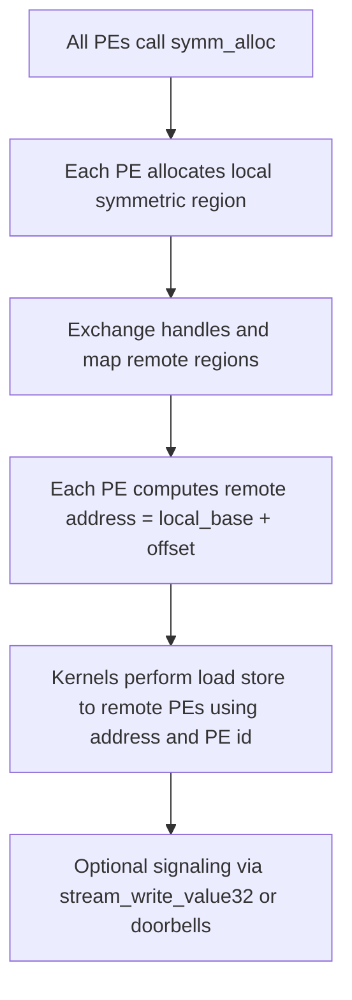
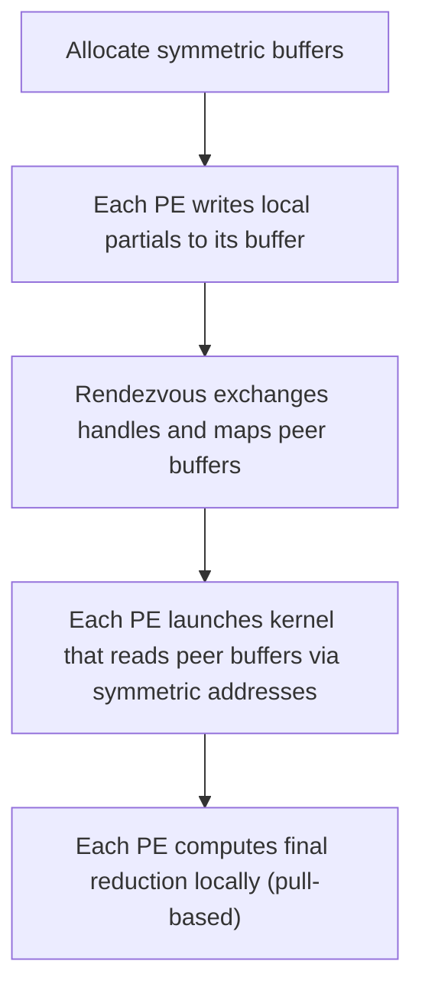

## 1) What is *Symmetric Memory*?

**Symmetric memory** is a remote-memory programming model that presents a *global address space* across GPUs (processing elements, PEs) in a job. Each PE allocates a symmetric region of memory; that symmetric allocation has the same size and layout on every PE and can be referenced by a *symmetric address* that is valid across peers. This allows kernels and user code to perform ultra-low-latency peer accesses and to implement custom, fine-grained P2P communication patterns.

Key properties:
- Allocation is **collective**: all PEs in the group allocate the same size region.
- The symmetric pointer plus a destination PE (rank) identifies the remote location.
- On systems with NVLink / NVLS, symmetric memory enables direct GPU-to-GPU loads/stores and efficient signaling mechanisms.

---

## 2) Why it matters (motivation)

Modern LLM training & inference push communication patterns beyond standard collectives (all-reduce, all-gather). Examples where symmetric memory helps:
- **One‑shot collectives** that pull data on demand rather than push (useful for sparse/reduce patterns).
- **Fine-grained P2P kernels** that implement custom rendezvous and signaling for low-latency overlap between compute and comm.
- **Implementing LM-scheduling or remote KV caches** where remote pages are accessed by pointer arithmetic and load/store semantics (LMCache-like designs).

---

## 3) How it works — conceptual flow



Points to note:
- `symm_alloc` is collective and returns a symmetric address that is valid across PEs.
- After allocation, a **rendezvous handshake** (handle exchange) maps peer memory into the local process’ address space (or provides handles used by device code). PyTorch provides helpers to perform this exchange.

---

## 4) Key primitives / APIs to use

### A. **PyTorch (SymmetricMemory layer)**
PyTorch exposes a SymmetricMemory API and op namespace to allocate and use symmetric buffers. Typical entry points include:

- `symm_mem.empty(shape, dtype=None, device="xpu")` — allocate a tensor backed by the symmetric allocator (semantics like `torch.empty`).
- `symm_mem.rendezvous(tensor, group_name)` — perform the handle exchange for a symmetric allocation so peers can access each other’s symmetric region.
- `torch.ops.symm_mem.*` — op namespace for fused device collectives and one‑shot kernels (example: one‑shot all‑reduce variants). Note: `torch.ops.symm_mem` is an op namespace — you call ops by their fully qualified name instead of `import`-ing it.

> Example (PyTorch-ish)
```python
import torch
import torch.distributed as dist
# allocate symmetric buffer using symm op namespace
buf = torch.ops.symm_mem.empty((1024,), dtype=torch.float32, device="xpu")
# perform rendezvous to exchange handles and map remote buffers
torch.ops.symm_mem.rendezvous(buf, group_name="world")
# call a symm op (implementation specific)
torch.ops.symm_mem.one_shot_all_reduce_(buf, "sum", "world")
```


## 5) Example: pull-based one-shot all reduce (conceptual)



This pattern is attractive when inputs are sparse or when pulling on demand reduces network load. vLLM and other projects have used symmetric memory for communication-aware kernels.

---

## 6) Advantages

- **Low-latency peer access** on NVLink-equipped systems.
- **Flexible communication patterns** (pull-based, one-shot collectives, custom rendezvous).
- **Good compute/comm overlap** using device signaling + direct loads/stores.
- **Framework-level interoperability** via PyTorch ops.

---

## 7) Disadvantages and caveats

- **Collective allocation requirement**: symmetric allocations must be identical across PEs — awkward for dynamic shapes.
- **Platform dependency**: NVSHMEM is NVIDIA-centric; other vendors may lack matching implementations or behave differently.
- **Complexity**: pointer math across PEs, race conditions when remapping, and rendezvous correctness are tricky.
- **API maturity**: PyTorch’s SymmetricMemory APIs are still alpha in some releases; expect rough edges and version drift.
- **Security / tenancy**: direct mapping gives peers low-level access that needs infrastructure controls for multi-tenant clusters.

---

## 8) Practical checklist when adopting Symmetric Memory

- Ensure homogeneous hardware with peer links (NVLink/NVLS) for best performance.
- Use rendezvous helpers from the framework (PyTorch v2.x or vLLM wrappers) to avoid manual handle exchanges.
- Keep symmetric allocations reasonably sized (avoid huge symmetric heaps per PE unless you have capacity).
- Add robust error handling around rendezvous and mapping (driver-level failures are common in early-stage APIs).
- Prefer higher-level ops in `torch.ops.symm_mem` where available rather than hand-rolling pointer code.

---

## 9) Future scope and research directions

- **Compiler support**: better contracts (e.g., `torch.compile` annotations) so compiled kernels can request symmetric buffers automatically.
- **Vendor-neutral symmetric backends** and portability layers.
- **Use with LMCache / PD / disaggregated KV stores** for scalable long-context serving.
- **Security and multi-tenant safe mappings** for cloud inference services.
- **Higher-level fused kernels** that exploit symmetric memory semantics for common patterns (one-shot collectives, remote gather, sparse routing).

---

## 10) References

- PyTorch SymmetricMemory docs.  
- Developer discussion: "PyTorch SymmetricMemory: Harnessing NVLink programmability".  
- NVSHMEM documentation (symmetric heap).  
- RFC: support symmetric memory in torch.compile.  
- TokenWeave / vLLM notes on symmetric memory use.

---
